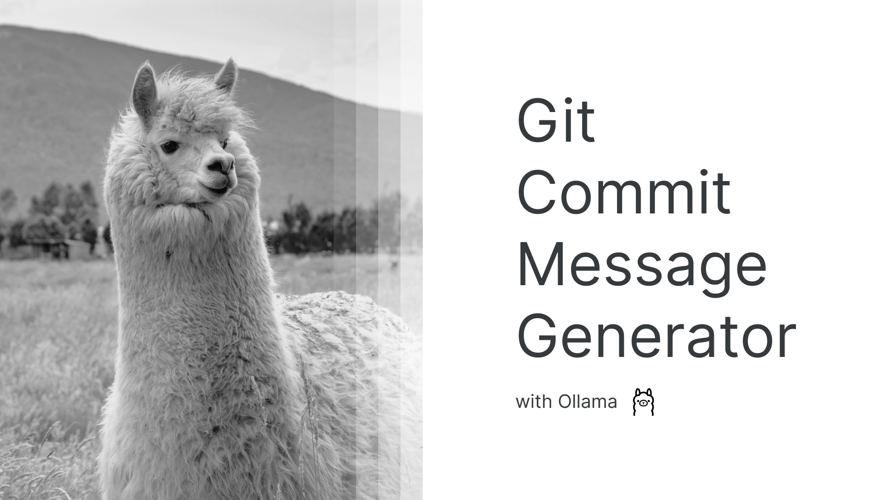
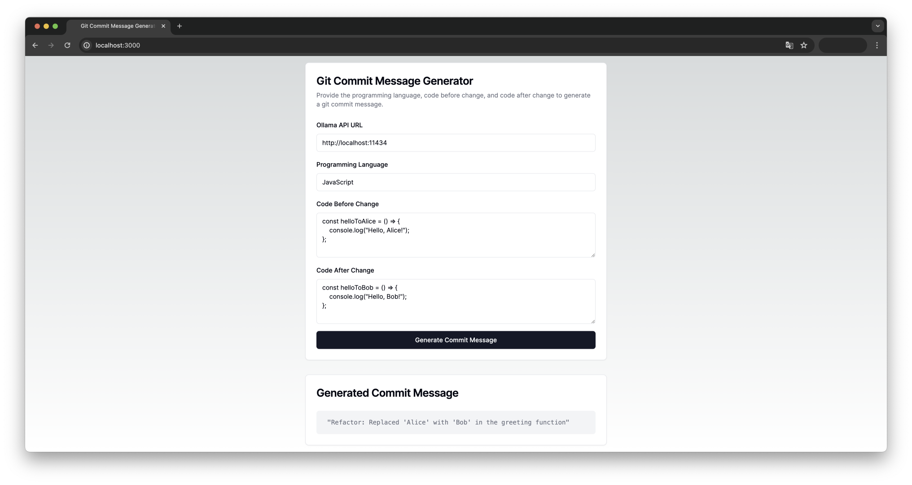

# Git Commit Message Generator

[Demo](https://git-commit-message-generator.vercel.app/)



> Git Commit Message Generator로 간단하게 커밋 메시지를 생성하세요.

## 시작하기

1. 본 소프트웨어는 [Ollama](https://ollama.ai/)와 함께 작동합니다. 로컬 컴퓨터에 Ollama를 설치하세요.
2. Ollama에서 [`mistral`](https://ollama.ai/library/mistral) 모델을 실행하세요.

   ```shell
   ollama run mistral
   ```

3. 리포지토리를 복제하고 서버를 실행하세요.

   ```shell
   git clone https://github.com/radiantbeing/git-commit-message-generator.git
   cd git-commit-message-generator
   npm install
   npm run build
   npm run start
   ```

4. http://localhost:3000 에 접속하세요.

   

## 유의 사항

`ERR_NETWORK: Network Error` 메시지가 출력된다면 아래의 목록을 따라 점검을 시작하세요.

1. **올바르지 않은 Ollama API URL**:

   Ollama API URL을 정확하게 입력했는지 확인해 주세요.

2. **Ollama 실행 확인**:

   컴퓨터에서 Ollama가 실행 중인지 확인해 주세요.

3. **CORS 오류**:

   Ollama와 Git Commit Message Generator가 동일한 컴퓨터에서 실행되고 있지 않으면 CORS 오류가 발생합니다. 이를 해결하기 위해 Ollama FAQ의 [How can I allow additional web origins to access Ollama?](https://github.com/jmorganca/ollama/blob/main/docs/faq.md#how-can-i-allow-additional-web-origins-to-access-ollama) 섹션을 참고해 주세요.
